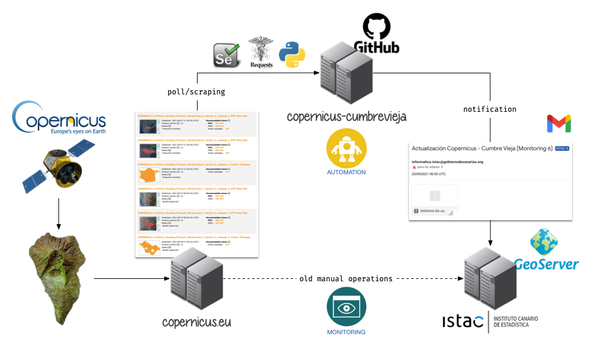

# copernicus-cumbrevieja

## Overview

ISTAC is [publishing geodata in its statistical atlas](https://www3.gobiernodecanarias.org/aplicaciones/appsistac/atlas/#start=%7B%22version%22%3A%220.0.05%22%2C%22initSources%22%3A%5B%7B%22initFragment%22%3A%22erupcion-volcanica-la-palma%22%7D%2C%7B%22initFragment%22%3A%22catalogo-datos-estadisticos%22%7D%2C%7B%22initFragment%22%3A%22referencias-cartograficas%22%7D%2C%7B%22catalog%22%3A%5B%7B%22name%22%3A%22User-Added+Data%22%2C%22description%22%3A%22El+grupo+de+datos+que+fue+agregado+por+el+usuario+a+trav%C3%A9s+del+panel+Agregar+datos.%22%2C%22info%22%3A%5B%5D%2C%22isUserSupplied%22%3Atrue%2C%22isPromoted%22%3Afalse%2C%22isHidden%22%3Afalse%2C%22forceProxy%22%3Afalse%2C%22customProperties%22%3A%7B%7D%2C%22id%22%3A%22Root+Group%2FUser-Added+Data%22%2C%22shortReportSections%22%3A%5B%5D%2C%22isWaitingForDisclaimer%22%3Afalse%2C%22hideSource%22%3Afalse%2C%22nameInCatalog%22%3A%22User-Added+Data%22%2C%22isOpen%22%3Afalse%2C%22items%22%3A%5B%5D%2C%22preserveOrder%22%3Afalse%2C%22type%22%3A%22group%22%2C%22parents%22%3A%5B%5D%7D%5D%7D%2C%7B%22sharedCatalogMembers%22%3A%7B%22Root+Group%2FErupci%C3%B3n+Volc%C3%A1nica+La+Palma+2021%22%3A%7B%22isOpen%22%3Atrue%2C%22type%22%3A%22group%22%2C%22parents%22%3A%5B%5D%7D%2C%22Root+Group%2FErupci%C3%B3n+Volc%C3%A1nica+La+Palma+2021%2FColada+magm%C3%A1tica%2FColada+magm%C3%A1tica.+%C3%9Altimos+datos+%2826%2F09%2F2021+07%3A08%29%22%3A%7B%22nowViewingIndex%22%3A4%2C%22isEnabled%22%3Atrue%2C%22isShown%22%3Atrue%2C%22isLegendVisible%22%3Afalse%2C%22useOwnClock%22%3Afalse%2C%22opacity%22%3A0.35%2C%22keepOnTop%22%3Afalse%2C%22splitDirection%22%3A0%2C%22showOnChart%22%3Afalse%2C%22styles%22%3A%22red_EMSR546_AOI01_GRA_MONIT07_observedEventA_r1_v1%22%2C%22type%22%3A%22wms%22%2C%22parents%22%3A%5B%22Root+Group%2FErupci%C3%B3n+Volc%C3%A1nica+La+Palma+2021%22%2C%22Root+Group%2FErupci%C3%B3n+Volc%C3%A1nica+La+Palma+2021%2FColada+magm%C3%A1tica%22%5D%7D%2C%22Root+Group%2FErupci%C3%B3n+Volc%C3%A1nica+La+Palma+2021%2FViviendas+afectadas+por+la+colada%2FViviendas+afectadas+por+la+colada.+%C3%9Altimos+datos+%2826%2F09%2F2021+07%3A08%29%22%3A%7B%22nowViewingIndex%22%3A3%2C%22isEnabled%22%3Atrue%2C%22isShown%22%3Atrue%2C%22isLegendVisible%22%3Afalse%2C%22useOwnClock%22%3Afalse%2C%22opacity%22%3A0.55%2C%22keepOnTop%22%3Afalse%2C%22splitDirection%22%3A0%2C%22showOnChart%22%3Afalse%2C%22styles%22%3A%22EMSR546_AOI01_GRA_PRODUCT_builtUpP_r1_v1%22%2C%22type%22%3A%22wms%22%2C%22parents%22%3A%5B%22Root+Group%2FErupci%C3%B3n+Volc%C3%A1nica+La+Palma+2021%22%2C%22Root+Group%2FErupci%C3%B3n+Volc%C3%A1nica+La+Palma+2021%2FViviendas+afectadas+por+la+colada%22%5D%7D%2C%22Root+Group%2FErupci%C3%B3n+Volc%C3%A1nica+La+Palma+2021%2FCarreteras+afectadas+por+la+colada%2FCarreteras+afectadas+por+la+colada.+%C3%9Altimos+datos+%2826%2F09%2F2021+07%3A08%29%22%3A%7B%22nowViewingIndex%22%3A2%2C%22isEnabled%22%3Atrue%2C%22isShown%22%3Atrue%2C%22isLegendVisible%22%3Afalse%2C%22useOwnClock%22%3Afalse%2C%22opacity%22%3A0.5%2C%22keepOnTop%22%3Afalse%2C%22splitDirection%22%3A0%2C%22showOnChart%22%3Afalse%2C%22styles%22%3A%22EMSR546_AOI01_GRA_PRODUCT_transportationL_r1_v1%22%2C%22type%22%3A%22wms%22%2C%22parents%22%3A%5B%22Root+Group%2FErupci%C3%B3n+Volc%C3%A1nica+La+Palma+2021%22%2C%22Root+Group%2FErupci%C3%B3n+Volc%C3%A1nica+La+Palma+2021%2FCarreteras+afectadas+por+la+colada%22%5D%7D%2C%22Root+Group%2FErupci%C3%B3n+Volc%C3%A1nica+La+Palma+2021%2FLocalizaci%C3%B3n+vulcanol%C3%B3gica%22%3A%7B%22isOpen%22%3Atrue%2C%22type%22%3A%22group%22%2C%22parents%22%3A%5B%22Root+Group%2FErupci%C3%B3n+Volc%C3%A1nica+La+Palma+2021%22%5D%7D%2C%22Root+Group%2FErupci%C3%B3n+Volc%C3%A1nica+La+Palma+2021%2FLocalizaci%C3%B3n+vulcanol%C3%B3gica%2FLocalizaci%C3%B3n+vulcanol%C3%B3gica.+%C3%9Altimos+datos+%2826%2F09%2F2021+07%3A08%29%22%3A%7B%22nowViewingIndex%22%3A1%2C%22isEnabled%22%3Atrue%2C%22isShown%22%3Atrue%2C%22isLegendVisible%22%3Afalse%2C%22useOwnClock%22%3Afalse%2C%22opacity%22%3A0.6%2C%22keepOnTop%22%3Afalse%2C%22splitDirection%22%3A0%2C%22showOnChart%22%3Afalse%2C%22styles%22%3A%22EMSR546_AOI01_GRA_PRODUCT_observedEventP_r1_v1%22%2C%22type%22%3A%22wms%22%2C%22parents%22%3A%5B%22Root+Group%2FErupci%C3%B3n+Volc%C3%A1nica+La+Palma+2021%22%2C%22Root+Group%2FErupci%C3%B3n+Volc%C3%A1nica+La+Palma+2021%2FLocalizaci%C3%B3n+vulcanol%C3%B3gica%22%5D%7D%2C%22Root+Group%2FDatos+Estad%C3%ADsticos%22%3A%7B%22isOpen%22%3Atrue%2C%22type%22%3A%22group%22%2C%22parents%22%3A%5B%5D%7D%2C%22Root+Group%2FDatos+Estad%C3%ADsticos%2FEstructura+de+poblaci%C3%B3n+e+indicadores+demogr%C3%A1ficos%2FMalla+de++250m%2FIndicadores+Demogr%C3%A1ficos.+Malla++de+250m.+2020%22%3A%7B%22name%22%3A%22Indicadores+Demogr%C3%A1ficos.+Malla++de+250m.+2020%22%2C%22nowViewingIndex%22%3A5%2C%22url%22%3A%22https%3A%2F%2Fdatos.canarias.es%2Fcatalogos%2Festadisticas%2Fdataset%2F8516adf0-ad7e-4bfd-a8bb-d4aa393d146e%2Fresource%2F9c7a94ca-6495-41a2-bc53-5a045b0045c0%2Fdownload%2F20200101_indicadores_demograficos_pmh.csv%22%2C%22isEnabled%22%3Atrue%2C%22isShown%22%3Atrue%2C%22isLegendVisible%22%3Afalse%2C%22useOwnClock%22%3Afalse%2C%22opacity%22%3A%22.8%22%2C%22keepOnTop%22%3Afalse%2C%22splitDirection%22%3A0%2C%22tableStyle%22%3A%7B%22scale%22%3A1%2C%22colorBins%22%3A7%2C%22colorBinMethod%22%3A%22auto%22%2C%22colorMap%22%3A%5B%7B%22color%22%3A%22rgba%2855%2C+106%2C+38%2C+1.0%29%22%2C%22offset%22%3A0%7D%2C%7B%22color%22%3A%22rgba%28103%2C+162%2C+63%2C+1.0%29%22%2C%22offset%22%3A0.1666%7D%2C%7B%22color%22%3A%22rgba%28154%2C+196%2C+125%2C+1.0%29%22%2C%22offset%22%3A0.3333%7D%2C%7B%22color%22%3A%22rgba%28206%2C+214%2C+221%2C+1.0%29%22%2C%22offset%22%3A0.5%7D%2C%7B%22color%22%3A%22rgba%28188%2C+153%2C+103%2C+1.0%29%22%2C%22offset%22%3A0.6666%7D%2C%7B%22color%22%3A%22rgba%28140%2C+92%2C+29%2C+1.0%29%22%2C%22offset%22%3A0.8333%7D%2C%7B%22color%22%3A%22rgba%28104%2C+68%2C+21%2C+1.0%29%22%2C%22offset%22%3A1%7D%5D%2C%22legendTicks%22%3A3%2C%22regionVariable%22%3A%22geocode%22%2C%22regionType%22%3A%22MALLA_250%22%2C%22dataVariable%22%3A%22Poblaci%C3%B3n%22%2C%22columns%22%3A%7B%22geocode%22%3A%7B%22colorBinMethod%22%3A%22auto%22%2C%22legendTicks%22%3A3%2C%22type%22%3A%22hidden%22%2C%22active%22%3Afalse%7D%2C%22geoparent%22%3A%7B%22colorBinMethod%22%3A%22auto%22%2C%22legendTicks%22%3A3%2C%22type%22%3A%22hidden%22%2C%22active%22%3Afalse%7D%2C%22fecha%22%3A%7B%22colorBinMethod%22%3A%22auto%22%2C%22legendTicks%22%3A3%2C%22type%22%3A%22hidden%22%2C%22active%22%3Afalse%7D%2C%22granularidad%22%3A%7B%22colorBinMethod%22%3A%22auto%22%2C%22legendTicks%22%3A3%2C%22type%22%3A%22hidden%22%2C%22active%22%3Afalse%7D%2C%22gcd_isla%22%3A%7B%22colorBinMethod%22%3A%22auto%22%2C%22legendTicks%22%3A3%2C%22type%22%3A%22hidden%22%2C%22active%22%3Afalse%7D%2C%22gcd_gcomarca%22%3A%7B%22colorBinMethod%22%3A%22auto%22%2C%22legendTicks%22%3A3%2C%22type%22%3A%22hidden%22%2C%22active%22%3Afalse%7D%2C%22gcd_comarca%22%3A%7B%22colorBinMethod%22%3A%22auto%22%2C%22legendTicks%22%3A3%2C%22type%22%3A%22hidden%22%2C%22active%22%3Afalse%7D%2C%22gcd_municipio%22%3A%7B%22colorBinMethod%22%3A%22auto%22%2C%22legendTicks%22%3A3%2C%22type%22%3A%22hidden%22%2C%22active%22%3Afalse%7D%2C%22poblacion%22%3A%7B%22colorBinMethod%22%3A%22auto%22%2C%22legendTicks%22%3A3%2C%22name%22%3A%22Poblaci%C3%B3n%22%2C%22active%22%3Atrue%7D%2C%22poblacion_edad_media%22%3A%7B%22colorBinMethod%22%3A%22auto%22%2C%22legendTicks%22%3A3%2C%22name%22%3A%22Poblaci%C3%B3n.+Edad+media%22%2C%22active%22%3Afalse%7D%2C%22poblacion_hombres%22%3A%7B%22colorBinMethod%22%3A%22auto%22%2C%22legendTicks%22%3A3%2C%22name%22%3A%22Poblaci%C3%B3n.+Hombres%22%2C%22active%22%3Afalse%7D%2C%22poblacion_mujeres%22%3A%7B%22colorBinMethod%22%3A%22auto%22%2C%22legendTicks%22%3A3%2C%22name%22%3A%22Poblaci%C3%B3n.+Mujeres%22%2C%22active%22%3Afalse%7D%2C%22poblacion_indice_feminidad%22%3A%7B%22colorBinMethod%22%3A%22auto%22%2C%22legendTicks%22%3A3%2C%22name%22%3A%22Poblaci%C3%B3n.+%C3%8Dndice+de+feminidad%22%2C%22active%22%3Afalse%7D%2C%22poblacion_nacional%22%3A%7B%22colorBinMethod%22%3A%22auto%22%2C%22legendTicks%22%3A3%2C%22name%22%3A%22Poblaci%C3%B3n+de+nacionalidad+espa%C3%B1ola%22%2C%22active%22%3Afalse%7D%2C%22poblacion_extranjera%22%3A%7B%22colorBinMethod%22%3A%22auto%22%2C%22legendTicks%22%3A3%2C%22name%22%3A%22Poblaci%C3%B3n+de+nacionalidad+extranjera%22%2C%22active%22%3Afalse%7D%2C%22poblacion_extranjera_pc%22%3A%7B%22colorBinMethod%22%3A%22auto%22%2C%22legendTicks%22%3A3%2C%22name%22%3A%22Poblaci%C3%B3n+de+nacionalidad+extranjera+%28%25%29%22%2C%22active%22%3Afalse%7D%2C%22poblacion_00a14%22%3A%7B%22colorBinMethod%22%3A%22auto%22%2C%22legendTicks%22%3A3%2C%22name%22%3A%22Poblaci%C3%B3n+de+0+a+14+a%C3%B1os+de+edad%22%2C%22active%22%3Afalse%7D%2C%22poblacion_15a64%22%3A%7B%22colorBinMethod%22%3A%22auto%22%2C%22legendTicks%22%3A3%2C%22name%22%3A%22Poblaci%C3%B3n+de+15+a+64+a%C3%B1os+de+edad%22%2C%22active%22%3Afalse%7D%2C%22poblacion_65mas%22%3A%7B%22colorBinMethod%22%3A%22auto%22%2C%22legendTicks%22%3A3%2C%22name%22%3A%22Poblaci%C3%B3n+de+65+o+m%C3%A1s+a%C3%B1os+de+edad%22%2C%22active%22%3Afalse%7D%2C%22poblacion_65a74%22%3A%7B%22colorBinMethod%22%3A%22auto%22%2C%22legendTicks%22%3A3%2C%22name%22%3A%22Poblaci%C3%B3n+de+65+a+74+a%C3%B1os+de+edad%22%7D%2C%22poblacion_75a84%22%3A%7B%22colorBinMethod%22%3A%22auto%22%2C%22legendTicks%22%3A3%2C%22name%22%3A%22Poblaci%C3%B3n+de+75+a+84+a%C3%B1os+de+edad%22%7D%2C%22poblacion_85mas%22%3A%7B%22colorBinMethod%22%3A%22auto%22%2C%22legendTicks%22%3A3%2C%22name%22%3A%22Poblaci%C3%B3n+de+85+o+m%C3%A1s+a%C3%B1os+de+edad%22%7D%2C%22poblacion_00a14_pc%22%3A%7B%22colorBinMethod%22%3A%22auto%22%2C%22legendTicks%22%3A3%2C%22name%22%3A%22Poblaci%C3%B3n+de+0+a+14+a%C3%B1os+de+edad+%28%25%29%22%2C%22active%22%3Afalse%7D%2C%22poblacion_15a64_pc%22%3A%7B%22colorBinMethod%22%3A%22auto%22%2C%22legendTicks%22%3A3%2C%22name%22%3A%22Poblaci%C3%B3n+de+15+a+64+a%C3%B1os+de+edad+%28%25%29%22%2C%22active%22%3Afalse%7D%2C%22poblacion_65mas_pc%22%3A%7B%22colorBinMethod%22%3A%22auto%22%2C%22legendTicks%22%3A3%2C%22name%22%3A%22Poblaci%C3%B3n+de+65+o+m%C3%A1s+a%C3%B1os+de+edad+%28%25%29%22%2C%22active%22%3Afalse%7D%2C%22poblacion_indice_dependencia%22%3A%7B%22colorBinMethod%22%3A%22auto%22%2C%22legendTicks%22%3A3%2C%22name%22%3A%22Poblaci%C3%B3n.+%C3%8Dndice+de+dependencia%22%2C%22active%22%3Afalse%7D%2C%22poblacion_indice_dependencia_mayores%22%3A%7B%22colorBinMethod%22%3A%22auto%22%2C%22legendTicks%22%3A3%2C%22name%22%3A%22Poblaci%C3%B3n.+%C3%8Dndice+de+dependencia+mayores+de+64+a%C3%B1os%22%2C%22active%22%3Afalse%7D%2C%22poblacion_indice_dependencia_menores%22%3A%7B%22colorBinMethod%22%3A%22auto%22%2C%22legendTicks%22%3A3%2C%22name%22%3A%22Poblaci%C3%B3n.+%C3%8Dndice+de+dependencia+menores+de+15+a%C3%B1os%22%2C%22active%22%3Afalse%7D%2C%22poblacion_indice_vejez%22%3A%7B%22colorBinMethod%22%3A%22auto%22%2C%22legendTicks%22%3A3%2C%22name%22%3A%22%C3%8Dndice+de+Vejez%22%2C%22active%22%3Afalse%7D%2C%22poblacion_indice_juventud%22%3A%7B%22colorBinMethod%22%3A%22auto%22%2C%22legendTicks%22%3A3%2C%22name%22%3A%22%C3%8Dndice+de+Juventud%22%2C%22active%22%3Afalse%7D%2C%22poblacion_indice_sobreenvejecimiento%22%3A%7B%22colorBinMethod%22%3A%22auto%22%2C%22legendTicks%22%3A3%2C%22name%22%3A%22%C3%8Dndice+de+Sobreenvejecimiento%22%7D%2C%22poblacion_indice_ancianidad%22%3A%7B%22colorBinMethod%22%3A%22auto%22%2C%22legendTicks%22%3A3%2C%22name%22%3A%22%C3%8Dndice+de+Ancianidad%22%7D%2C%22superficie%22%3A%7B%22colorBinMethod%22%3A%22auto%22%2C%22legendTicks%22%3A3%2C%22name%22%3A%22superficie%22%2C%22type%22%3A%22hidden%22%2C%22active%22%3Afalse%7D%2C%22poblacion_ds%22%3A%7B%22colorBinMethod%22%3A%22auto%22%2C%22legendTicks%22%3A3%2C%22name%22%3A%22Densidad+de+Poblaci%C3%B3n%22%2C%22active%22%3Afalse%7D%2C%22poblacion_extranjera_ds%22%3A%7B%22colorBinMethod%22%3A%22auto%22%2C%22legendTicks%22%3A3%2C%22name%22%3A%22Densidad+de+Poblaci%C3%B3n+Extranjera%22%2C%22active%22%3Afalse%7D%2C%22poblacion_00a02%22%3A%7B%22colorBinMethod%22%3A%22auto%22%2C%22legendTicks%22%3A3%2C%22name%22%3A%22Poblaci%C3%B3n+de+0+a+2+a%C3%B1os%22%7D%2C%22poblacion_03a05%22%3A%7B%22colorBinMethod%22%3A%22auto%22%2C%22legendTicks%22%3A3%2C%22name%22%3A%22Poblaci%C3%B3n+de+3+a+5+a%C3%B1os%22%7D%2C%22poblacion_06a11%22%3A%7B%22colorBinMethod%22%3A%22auto%22%2C%22legendTicks%22%3A3%2C%22name%22%3A%22Poblaci%C3%B3n+de+6+a+11+a%C3%B1os%22%7D%2C%22poblacion_12a15%22%3A%7B%22colorBinMethod%22%3A%22auto%22%2C%22legendTicks%22%3A3%2C%22name%22%3A%22Poblaci%C3%B3n+de+12+a+15+a%C3%B1os%22%7D%2C%22poblacion_16a17%22%3A%7B%22colorBinMethod%22%3A%22auto%22%2C%22legendTicks%22%3A3%2C%22name%22%3A%22Poblaci%C3%B3n+de+16+a+17+a%C3%B1os%22%7D%2C%22poblacion_00a17%22%3A%7B%22colorBinMethod%22%3A%22auto%22%2C%22legendTicks%22%3A3%2C%22name%22%3A%22Poblaci%C3%B3n+de+0+a+17+a%C3%B1os%22%7D%2C%22poblacion_nacida_canarias%22%3A%7B%22colorBinMethod%22%3A%22auto%22%2C%22legendTicks%22%3A3%2C%22name%22%3A%22Poblaci%C3%B3n.+Nacidos+en+Canarias%22%2C%22active%22%3Afalse%7D%2C%22poblacion_nacida_es_xcanarias%22%3A%7B%22colorBinMethod%22%3A%22auto%22%2C%22legendTicks%22%3A3%2C%22name%22%3A%22Poblaci%C3%B3n.+Nacidos+en+el+resto+de+Espa%C3%B1a%22%2C%22active%22%3Afalse%7D%2C%22poblacion_nacida_extranjero%22%3A%7B%22colorBinMethod%22%3A%22auto%22%2C%22legendTicks%22%3A3%2C%22name%22%3A%22Poblaci%C3%B3n.+Nacidos+en+el+extranjero%22%2C%22active%22%3Afalse%7D%2C%22poblacion_nacida_canarias_pc%22%3A%7B%22colorBinMethod%22%3A%22auto%22%2C%22legendTicks%22%3A3%2C%22name%22%3A%22Poblaci%C3%B3n.+Nacidos+en+Canarias+%28%25%29%22%2C%22active%22%3Afalse%7D%2C%22poblacion_nacida_es_xcanarias_pc%22%3A%7B%22colorBinMethod%22%3A%22auto%22%2C%22legendTicks%22%3A3%2C%22name%22%3A%22Poblaci%C3%B3n.+Nacidos+en+el+resto+de+Espa%C3%B1a+%28%25%29%22%2C%22active%22%3Afalse%7D%2C%22poblacion_nacida_extranjero_pc%22%3A%7B%22colorBinMethod%22%3A%22auto%22%2C%22legendTicks%22%3A3%2C%22name%22%3A%22Poblaci%C3%B3n.+Nacidos+en+el+extranjero+%28%25%29%22%2C%22active%22%3Afalse%7D%7D%7D%2C%22regenerationOptions%22%3A%7B%7D%2C%22isCsvForCharting%22%3Afalse%2C%22type%22%3A%22csv%22%2C%22parents%22%3A%5B%22Root+Group%2FDatos+Estad%C3%ADsticos%22%2C%22Root+Group%2FDatos+Estad%C3%ADsticos%2FEstructura+de+poblaci%C3%B3n+e+indicadores+demogr%C3%A1ficos%22%2C%22Root+Group%2FDatos+Estad%C3%ADsticos%2FEstructura+de+poblaci%C3%B3n+e+indicadores+demogr%C3%A1ficos%2FMalla+de++250m%22%5D%7D%2C%22Root+Group%2FReferencias+Cartogr%C3%A1ficas%22%3A%7B%22isOpen%22%3Atrue%2C%22type%22%3A%22group%22%2C%22parents%22%3A%5B%5D%7D%2C%22Root+Group%2FReferencias+Cartogr%C3%A1ficas%2FL%C3%ADmites+territoriales+de+Canarias%2FMunicipios%2FMunicipios%22%3A%7B%22nowViewingIndex%22%3A6%2C%22isEnabled%22%3Atrue%2C%22isShown%22%3Atrue%2C%22isLegendVisible%22%3Afalse%2C%22useOwnClock%22%3Afalse%2C%22opacity%22%3A0.6%2C%22keepOnTop%22%3Afalse%2C%22splitDirection%22%3A0%2C%22showOnChart%22%3Afalse%2C%22styles%22%3A%22line%22%2C%22type%22%3A%22wms%22%2C%22parents%22%3A%5B%22Root+Group%2FReferencias+Cartogr%C3%A1ficas%22%2C%22Root+Group%2FReferencias+Cartogr%C3%A1ficas%2FL%C3%ADmites+territoriales+de+Canarias%22%2C%22Root+Group%2FReferencias+Cartogr%C3%A1ficas%2FL%C3%ADmites+territoriales+de+Canarias%2FMunicipios%22%5D%7D%2C%22Root+Group%2FReferencias+Cartogr%C3%A1ficas%2FInfraestructuras+y+equipamientos%22%3A%7B%22isOpen%22%3Atrue%2C%22type%22%3A%22group%22%2C%22parents%22%3A%5B%22Root+Group%2FReferencias+Cartogr%C3%A1ficas%22%5D%7D%2C%22Root+Group%2FReferencias+Cartogr%C3%A1ficas%2FInfraestructuras+y+equipamientos%2FEncuesta+de+Infraestructura+y+Equipamiento+Local%22%3A%7B%22isOpen%22%3Atrue%2C%22type%22%3A%22group%22%2C%22parents%22%3A%5B%22Root+Group%2FReferencias+Cartogr%C3%A1ficas%22%2C%22Root+Group%2FReferencias+Cartogr%C3%A1ficas%2FInfraestructuras+y+equipamientos%22%5D%7D%2C%22Root+Group%2FReferencias+Cartogr%C3%A1ficas%2FInfraestructuras+y+equipamientos%2FEncuesta+de+Infraestructura+y+Equipamiento+Local%2FCentros+de+Ense%C3%B1anza%22%3A%7B%22nowViewingIndex%22%3A0%2C%22isEnabled%22%3Atrue%2C%22isShown%22%3Atrue%2C%22isLegendVisible%22%3Afalse%2C%22useOwnClock%22%3Afalse%2C%22opacity%22%3A0.6%2C%22keepOnTop%22%3Afalse%2C%22splitDirection%22%3A0%2C%22showOnChart%22%3Afalse%2C%22styles%22%3A%22%22%2C%22type%22%3A%22wms%22%2C%22parents%22%3A%5B%22Root+Group%2FReferencias+Cartogr%C3%A1ficas%22%2C%22Root+Group%2FReferencias+Cartogr%C3%A1ficas%2FInfraestructuras+y+equipamientos%22%2C%22Root+Group%2FReferencias+Cartogr%C3%A1ficas%2FInfraestructuras+y+equipamientos%2FEncuesta+de+Infraestructura+y+Equipamiento+Local%22%5D%7D%2C%22Root+Group%2FReferencias+Cartogr%C3%A1ficas%2FProtecci%C3%B3n+y+usos+del+suelo%22%3A%7B%22isOpen%22%3Atrue%2C%22type%22%3A%22group%22%2C%22parents%22%3A%5B%22Root+Group%2FReferencias+Cartogr%C3%A1ficas%22%5D%7D%7D%7D%2C%7B%22initialCamera%22%3A%7B%22west%22%3A-17.979040145874027%2C%22south%22%3A28.56937146331029%2C%22east%22%3A-17.789354324340824%2C%22north%22%3A28.659261153016082%7D%2C%22homeCamera%22%3A%7B%22west%22%3A-19%2C%22south%22%3A27%2C%22east%22%3A-13%2C%22north%22%3A29.999999999999996%7D%2C%22baseMapName%22%3A%22Bing+Maps+Aerial+with+Labels%22%2C%22viewerMode%22%3A%222d%22%2C%22currentTime%22%3A%7B%22dayNumber%22%3A2459485%2C%22secondsOfDay%22%3A4670.993%7D%2C%22showSplitter%22%3Afalse%2C%22splitPosition%22%3A0.5%7D%2C%7B%22stories%22%3A%5B%5D%7D%5D%7D) about [eruptions in La Palma volcano](https://www.bbc.com/news/world-europe-58681233) beginning September 2021. Lava movements are registered by Copernicus satellite and published on its website [copernicus.eu](https://emergency.copernicus.eu/mapping/list-of-components/EMSR546).

The problem is that **these data is not periodically exposed or might be even in a non finished state in quality terms**. Statistical technicians would have to check "manually" if the website has published geodata.

This tool tries to minimise human efforts in terms of data acquisition and delivery about Volcano Eruption in Cumbre Vieja (La Palma)



## Instalation

Clone this repo, create a [Python 3 virtualenv](https://docs.python.org/3/library/venv.html) and install the dependencies:

```console
$ pip install -r requirements.txt
```

Fill out, at least, the following settings in a `.env` :

- `COPERNICUS_COMPONENT_ID`
- `TARGET_MAP_ID`
- `NOTIFICATION_FROM_ADDR`
- `NOTIFICATION_TO_ADDRS`
- `SMTP_SERVER`
- `SMTP_PORT`
- `SMTP_USERNAME`
- `SMTP_PASSWORD`
- `KEYVALUE_API_TOKEN` | https://keyvalue.immanuel.co/api/KeyVal/GetAppKey

## Usage

Following command will download the corresponding package vector and pdf file for the given copernicus component id and target monitoring id:

```console
$ python main.py
```

### Options

```console
$ python main.py --help

Usage: main.py [OPTIONS]

Options:
  -m, --monitoring-id INTEGER  Target monitoring id. If 0, a key-value online
                               storage is used instead!  [default: 0]
  -vv, --verbose               Loglevel increased to debug
  -x, --clean                  Remove download folder after execution
  -n, --notify                 Notify vectors package via email
  --help                       Show this message and exit.
```
